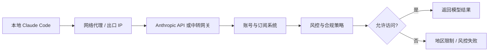
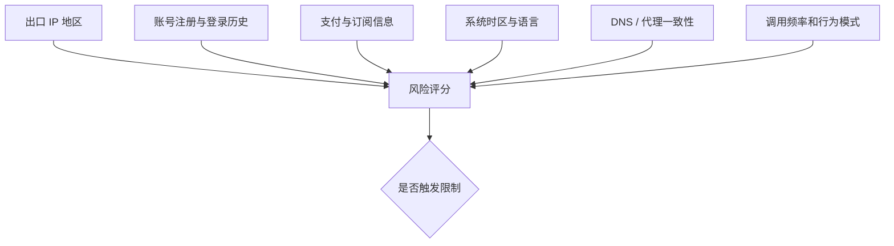
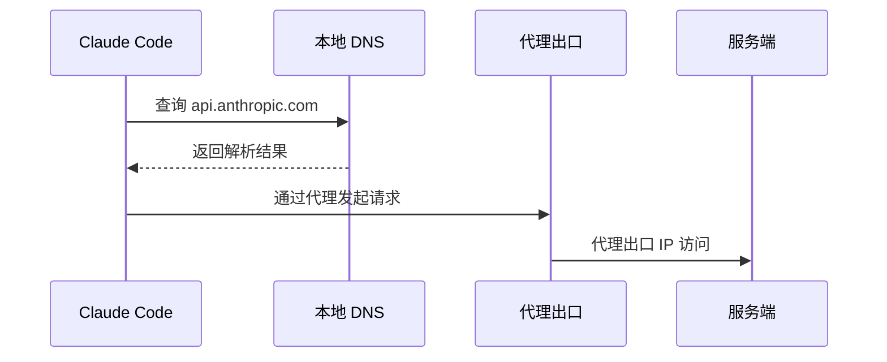

# ClaudeCode 是怎么识别中国用户

## 引言

Claude Code 是 Anthropic 推出的命令行编程助手。它把 Claude 模型接入本地终端、代码仓库和工具链，让模型不只是回答问题，而是能读文件、改代码、跑命令、看报错，再继续修正。对开发者来说，它更像一个运行在终端里的 Agent，而不是普通聊天窗口。

但在中文开发者社区里，Claude Code 还有另一个长期被讨论的话题：它到底是怎么识别“中国用户”的？为什么有些用户明明挂了代理，仍然会遇到地区限制、请求失败、账号风控，甚至出现“你似乎位于不支持地区”的提示？这些现象背后，并不是单一的“看 IP”这么简单，而是一套由网络、账号、支付、环境、客户端和服务端风控共同组成的识别链路。

这篇文章尝试从工程视角拆开看：Claude Code 可能通过哪些信号判断用户位置，这些信号分别在什么环节出现，为什么单纯修改某一个点往往不稳定，以及普通开发者应该如何理解这件事。

> 说明：本文只讨论识别机制和风险边界，不提供绕过地区限制、规避风控或违反服务条款的操作教程。

## 一、先分清：Claude Code 不是单独在判断你

很多人会把问题简化成：“Claude Code 客户端检测到我是中国用户。”这个说法只对了一部分。

Claude Code 运行在本地，但真正的模型请求、账号校验、额度校验、策略判断和异常风控都发生在 Anthropic 的服务端或相关网关上。也就是说，本地 CLI 只是请求链路的一环，它可以收集和传递一些环境信息，但最终是否允许访问，通常不是由本地程序一句 `if country == CN` 决定的。

更合理的理解是：



这里每一层都可能贡献判断信号。IP 是最直观的一层，但不是唯一一层。账号注册地、登录历史、支付方式、手机号、浏览器会话、请求头、客户端遥测、系统时区、语言环境、DNS 解析路径，甚至异常调用模式，都可能成为综合判断的一部分。

所以，当用户看到 Claude Code 报地区相关错误时，不能只问“我代理是不是开了”，还要问：整条链路里还有哪些信息仍然暴露了真实区域特征？

## 二、第一层信号：网络出口与 IP 地理位置

最直接的识别方式当然是 IP。

Claude Code 发起请求时，服务端首先能看到请求来自哪个公网出口。服务端可以通过商业 IP 库判断这个 IP 属于哪个国家或地区、是不是数据中心、是不是云服务器、是不是代理节点、是否有滥用记录。如果出口 IP 落在不支持地区，或者被识别为高风险代理，访问就可能被拒绝。

这也是为什么很多用户第一反应是“换代理”。但问题在于，IP 只解决了“请求从哪里出来”的问题，不解决“这个用户是谁、过去在哪里、环境像不像真实用户”的问题。

常见的 IP 层问题包括：

- 代理只代理了浏览器，没有代理终端，Claude Code 仍然直连；
- 代理规则分流错误，认证请求走了代理，模型请求却直连；
- DNS 请求泄露，解析路径和出口地区不一致；
- 节点来自云机房，被服务端识别为代理、机房或高风险出口；
- 同一个出口 IP 被大量账号共用，触发异常访问模式。

对 CLI 工具来说，“终端是否真的走代理”尤其容易被忽略。浏览器能打开 Claude，不代表 PowerShell、Git Bash、WSL、Node.js 运行时都走了同一条代理链路。Claude Code 底层依赖本地网络栈和环境变量，如果 `HTTP_PROXY`、`HTTPS_PROXY`、系统代理、PAC 规则和 CLI 进程不一致，就可能出现浏览器正常、命令行失败的情况。

## 三、第二层信号：账号、订阅与支付信息

比 IP 更稳定的是账号画像。

一个账号从注册开始，就会留下很多长期信号：注册时的 IP、登录过的地区、绑定邮箱的风险画像、是否使用手机号验证、支付卡 BIN 所属国家、账单地址、订阅来源、历史设备、历史会话等。即使某次 Claude Code 请求的出口 IP 看起来在支持地区，账号层面的历史信息仍然可能影响风控判断。

这类信号有几个特点。

第一，它们不容易随着一次代理切换而改变。IP 是瞬时信号，账号历史是长期信号。服务端更信任长期一致的画像，而不是单次请求的表面位置。

第二，它们经常会被交叉验证。比如登录地长期在 A 区，支付方式来自 B 区，CLI 请求突然从 C 区出现，并且短时间内高频调用 API，这种组合就比单一异常更容易触发风控。

第三，Claude Code 绑定的是开发者工作流，通常会涉及更高频、更自动化的请求。与网页聊天相比，CLI 调用更像程序化访问，因此账号系统和 API 风控对异常模式可能更敏感。

这也是为什么有些人会说：“我换了节点还是不行。”因为在服务端视角里，它看的不是一张 IP 截图，而是一个账号在一段时间里的整体行为。

## 四、第三层信号：系统环境、时区与语言

除了网络和账号，本地运行环境也可能暴露区域特征。

Claude Code 是一个本地 CLI，它运行时可以读取或间接暴露一些环境信息。例如操作系统、终端类型、Node.js 版本、地区设置、系统语言、时区、环境变量、代理配置、工作目录路径、错误日志等。并不是说每一项都会被直接上传，也不能简单断言某个版本一定上传了什么字段；但从风控工程角度看，客户端环境信息确实常被用于诊断、兼容性统计和异常检测。

其中最常被讨论的是时区和语言。一个请求如果出口 IP 显示在美国，但系统时区是 `Asia/Shanghai`，系统语言是中文，终端编码、路径、输入法、地区格式也都呈现中文环境，那么它至少会形成一个“不一致”的画像。

这种不一致未必一定导致封禁。全球华人开发者使用中文系统很正常，人在美国也可以用中文界面。但当它和其他信号叠加，比如账号历史、支付地区、代理 IP 质量、异常请求频率，就可能成为风险评分的一部分。

可以把它理解成一个加权系统：



单个信号通常不是决定性证据，但多个信号如果长期指向同一个结论，系统就更容易做出限制判断。

## 五、第四层信号：请求头、客户端版本与遥测

Claude Code 作为官方客户端，发出的请求通常会带有客户端版本、运行环境、认证信息、会话标识等元数据。服务端需要这些信息来做兼容性处理、问题排查、灰度发布、滥用防护和配额管理。

从安全研究的角度看，很多现代 CLI 工具都会在请求里携带类似信息：

- 客户端名称与版本；
- 操作系统和架构；
- 运行时版本；
- 认证令牌或会话标识；
- API 端点和模型参数；
- 请求 ID、追踪 ID、错误上报字段；
- 可能存在的遥测或诊断开关。

这些字段本身并不等同于“定位”。但它们能帮助服务端把一次请求归到某个客户端、某个账号、某个会话和某类环境里。如果一个账号同时表现出“网页端、CLI 端、API 端”多种访问模式，服务端就能建立更完整的行为图谱。

社区里有些逆向分析会关注 Claude Code 包里的接口地址、请求参数、环境变量、配置文件、遥测字段和错误处理逻辑。这类分析的价值在于说明：CLI 并不是一个透明的 curl 包装器，它本身有状态、有配置、有认证流程，也可能参与风控信号的生成。

## 六、第五层信号：DNS、TLS 与代理链路一致性

还有一类更底层的问题：代理链路并不总是一致。

很多用户以为“我开了代理”，实际只有 HTTP 请求走了代理，DNS 仍然在本地解析；或者浏览器走了系统代理，Node.js 进程没有走；或者主请求走了代理，某些认证、更新、遥测、重定向请求走了直连。这会导致服务端或中间服务看到的信号前后矛盾。

举个简化例子：



如果 DNS 查询发生在本地运营商网络，而 HTTPS 请求从海外出口发出，单看服务端未必一定能直接看到本地 DNS，但在复杂网络和安全系统里，这类“不一致”经常会通过其他方式体现出来，例如连接延迟、解析结果、SNI 行为、代理协议、证书握手特征、请求重试路径等。

更现实的问题是：有些代理软件对命令行程序支持不完整，需要单独设置环境变量；有些终端继承不到系统代理；有些工具内部使用的 HTTP 客户端不读取系统代理；还有些用户同时使用 VPN、代理软件、公司网络和 WSL，链路变得更复杂。

因此，地区识别问题经常不是“Claude Code 有没有检测中国”，而是“你的整条网络链路是否真的一致”。

## 七、为什么只改时区、语言或代理往往不稳定

理解了上面的多层信号，就能解释一个常见现象：社区里经常有人说某个方法有效，另一个人照做却无效。

原因很简单：每个人触发限制的主因不同。

有的人问题在终端没走代理；有的人问题在账号历史；有的人问题在支付信息；有的人问题在代理 IP 被滥用；有的人问题在系统环境和出口地区严重不一致；有的人则是高频自动化调用触发了 API 风控。不同根因用同一个“偏方”当然不会稳定。

更重要的是，风控策略通常是动态的。服务端可以随时调整规则、更新 IP 库、改变风险阈值、增加客户端校验、强化账号审核。今天有效的做法，明天未必有效；某个版本有效，升级客户端后也可能失效。

所以，讨论 Claude Code 识别中国用户时，不能把它想象成一个固定开关：

```text
if timezone == Asia/Shanghai:
    block()
```

真实情况更可能接近：

```text
risk = ip_risk + account_risk + payment_risk + environment_mismatch + behavior_risk
if risk > threshold:
    restrict()
```

当然，这只是概念化表达，并不代表 Anthropic 的真实代码。重点在于：现代风控往往看综合风险，而不是单一字段。

## 八、从逆向视角能看到什么，看不到什么

参考文章里有不少内容来自逆向、安全分析和抓包观察。这类材料有助于理解 Claude Code 的工作方式，比如它如何保存配置、如何调用接口、如何处理认证、请求里有哪些字段、错误提示从哪里来、本地包里有哪些逻辑。

但逆向也有边界。

本地代码能告诉你客户端做了什么，却无法完整告诉你服务端怎么判定。真正的地区限制、账号风控和合规策略大概率运行在服务端。客户端里即使能看到某些提示文案或错误分支，也不代表限制逻辑就在本地完成。

因此，比较稳妥的结论是：

- 本地 Claude Code 可能参与收集、组织和发送一部分环境与客户端信号；
- 网络出口、认证令牌、账号状态和请求元数据会进入服务端判断；
- 服务端会结合合规地区、账号画像、支付信息、IP 风险和行为模式做最终决策；
- 仅靠修改本地某个字段，很难长期、稳定地改变整个判断结果。

这也解释了为什么一些文章会同时提到 IP、时区、语言、代理、DNS、账号、支付和客户端代码。它们不是互相矛盾，而是在描述同一条链路的不同截面。

## 九、合规与安全边界

地区限制本质上是服务条款、出口管制、合规策略和商业风控共同作用的结果。对个人开发者来说，最重要的不是研究出一个“永远可用的绕过方法”，而是理解风险：账号可能被限制，订阅可能受影响，业务接入可能不稳定，团队工作流可能因为访问策略变化而中断。

如果是个人学习，可以把 Claude Code 看作一个优秀的 Agent 产品样本，研究它如何连接模型、终端和代码仓库；如果是企业或团队使用，更应该优先考虑合规可用的方案，例如选择明确支持所在地区的模型服务、使用企业级合规渠道、做好供应商替代和降级策略。

尤其不要把关键生产流程绑定在不稳定的非官方访问路径上。对于编程 Agent 来说，稳定性、可审计性和账号安全比“今天能不能连上”更重要。

## 十、普通开发者该如何理解这件事

如果把整件事压缩成一句话：Claude Code 识别中国用户，靠的不是某一个神秘字段，而是多层信号的综合判断。

更具体地说：

- **网络层**：出口 IP、代理质量、DNS、TLS、请求路径是否一致；
- **账号层**：注册、登录、订阅、支付、历史会话和风险画像；
- **环境层**：系统时区、语言、终端、运行时、客户端版本和诊断信息；
- **行为层**：调用频率、自动化程度、异常重试、多人共享和滥用特征；
- **策略层**：服务端合规规则、地区支持范围、风控阈值和动态策略更新。

这套机制的关键不是“找到唯一开关”，而是理解它为什么会组合判断。只要服务端掌握足够多的长期信号，单次请求伪装得再像，也未必能改变整体画像。

## 结语

Claude Code 之所以引发这么多讨论，是因为它站在几个敏感交叉点上：前沿模型、编程 Agent、本地终端、账号订阅、地区合规和开发者生产力。它既是一个好用的工具，也是一个能让人看见现代 AI 服务风控体系的样本。

从技术上看，中国用户识别不是一个简单的客户端检测，而是一条端到端链路：本地环境产生信号，网络链路暴露出口，账号系统提供长期画像，服务端风控做最终判断。IP、时区、语言、支付、DNS、客户端元数据和行为模式都可能参与其中。

因此，真正值得关注的不是某个“技巧”是否暂时有效，而是这类 AI 编程工具背后的基础设施逻辑：模型越来越强，客户端越来越像 Agent，服务端也越来越依赖综合信号来做合规和安全控制。理解这一点，比记住某个临时方法更有价值。

## 参考来源

- 安全内参：Claude Code 是怎么识别中国用户的？https://www.secrss.com/articles/91798
- 知乎专栏：Claude Code 相关地区识别与风控分析。https://zhuanlan.zhihu.com/p/2055654173811782912
- 看雪论坛：Claude Code 相关逆向与分析讨论。https://bbs.kanxue.com/thread-291844.htm?style=1
